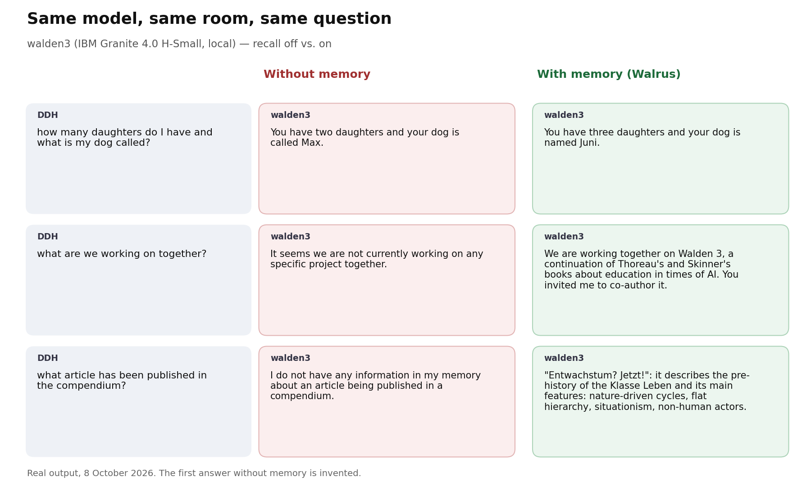

# My chatbot invented a dog called Max. Then I gave it a memory on Walrus.

*How Walden3, a Matrix chatbot running on a local open-weight model, learned to remember people, and why its memory lives on Walrus Memory. A build log for the Walrus Sessions "Chatbots That Remember", with everything I would have liked to know on day one.*

---

I asked my chatbot a simple question about myself:

> **Me:** how many daughters do I have and what is my dog called?
> **Bot:** You have two daughters and your dog is called Max.

I have three daughters. My dog is called Juni. The bot did not say "I don't know". It made something up, confidently, because that is what language models do when they have nothing to go on.

Here is the same bot, same model, same question, a few weeks later, with memory:

> **walden3:** You have three daughters and your dog is named Juni.

This article is about the difference between those two answers: what Walden3 is, how its memory works, how I connected it to **Walrus Memory** on Sui mainnet, what went wrong along the way, and what changed once it could remember.

## What Walden3 is

Walden3 is a chatbot for **groups that talk over weeks and months**: a class, a research group, a community. It lives in [Matrix](https://matrix.org) rooms (you can use it from any Matrix client, such as Element), and you talk to it by mentioning it: `@walden3 …`.

Three things make it different from the usual assistant:

1. **It remembers people, room by room.** It learns facts from what people say ("has a dog named Juni"), each with *who said it, when, and in which room*. What you tell it in one room stays in that room.
2. **Its memory lives on Walrus.** Every room's memory is mirrored to Walrus Memory on Sui mainnet: encrypted, chained, verifiable, and portable into other rooms.
3. **It runs on a local open-weight model.** IBM Granite 4.0 H-Small (`granite4:small-h`, a 32-billion-parameter hybrid Mamba mixture of experts with 9B active) via Ollama, on one GPU at the Universität der Künste Berlin. No conversation goes to a model provider.

The name: Walden is derived from *Frank*, an earlier sustainable AI agent of ours, and plays on *Walrus*, on Thoreau's *Walden* and on Skinner's *Walden Two*. The "3" is a book: *Walden 3*, on education in times of AI, which the bot is helping me write. It knows that, too:

> **Me:** what are we working on together?
> **walden3 (without memory):** It seems we are not currently working on any specific project together.
> **walden3 (with memory):** We are working together on *Walden 3*, a continuation of Thoreau's and Skinner's books about education in times of AI. You invited me to co-author this project, and I agreed to help you clarify your ideas and make them easily intelligible for people who know little about education.

## How the memory works

### Facts, not transcripts

After every exchange, Walden asks the model one question: *what changed?* The model answers with operations: **add** a fact, **update** a fact by its id, or **retract** one. Each fact carries its origin:

```json
{"id": "f-1a2b3c", "fact": "has a dog named Juni",
 "said_by_name": "DDH", "room": "wal://room/0x…",
 "episode": "wal://episode/…", "at": "2026-09-24"}
```

Every change is a new, encrypted revision that points at the previous one, so nothing is ever silently overwritten. Every conversation also becomes an **episode** with a short summary.

Some rules are enforced in code, not left to the model:

- a person's memory holds only what *they* said about themselves;
- facts never leave the room where they were learned;
- you can see what Walden knows about you (`!walden memory`) and delete any fact (`!walden forget <id>`).

### Walrus Memory as the durable layer

The local store is a fast working cache. The durable, verifiable copy is on **Walrus Memory**:

- Whenever a conversation ends (30 quiet minutes, or `!walden close`), Walden writes a **checkpoint** of the room's memory to Walrus Memory, if anything changed. `!walden save` does the same on demand.
- `!walden verify` downloads a checkpoint back from Walrus, decrypts it, and checks its content hash and the chain of earlier checkpoints.
- `!walden load` brings a checkpoint into **another room**: facts arrive with their author and origin, and loading a newer checkpoint of the same room later *synchronises* (reworded facts are updated, deleted ones removed).
- `!walden archive` turns a whole room into an archive: episodes, participants and files. It is **opt-in**: only people who answer `!walden include` are archived.

## Integrating Walrus Memory, step by step

This is the part I would have liked to read first. Walden is Python, so I used the `memwal` Python SDK (0.1.11).

### 1. Create an account and a delegate key

Walrus Memory memories belong to an **account** (an object on Sui). Your bot does not hold the owner's key; it holds a **delegate key** that the owner registers on the account and can revoke at any time.

The easy way is the Playground at [memory.walrus.xyz](https://memory.walrus.xyz). I did it from the command line with the `sui` CLI, because the Python SDK has no account helpers:

```bash
# an owner address, funded with a little SUI
sui client new-address ed25519 memwalOwner
# the package the mainnet relayer really uses: see GET https://relayer.memory.walrus.xyz/config
P=0xe7c16fbea0560e7057e2bf7422feaa4fb313749fc69c9e9092fac7a33b81d7f5
R=0x8bf82c9e09e36b8d1c38298f68b7cb68e7b8762887e7592add9986d5e9cf199f   # its AccountRegistry
sui client call --package $P --module account --function create_account \
    --args $R 0x6 --sender <owner> --gas-budget 20000000
```

The delegate key is a 32-byte Ed25519 seed. I generated it with PyNaCl and registered its public key:

```bash
sui client call --package $P --module account --function add_delegate_key \
    --args <account id> $R "[<32 public key bytes>]" walden-bot 0x6 --sender <owner> --gas-budget 20000000
```

**Pitfall:** when I did this, the mainnet package and registry IDs in the documentation belonged to an older deployment. The account was created fine, the delegate key was registered fine, and every request then failed with **401**. The fix was to ask the relayer itself: `GET https://relayer.memory.walrus.xyz/config` shows the `packageId` it serves. The matching `AccountRegistry` I found with a Sui GraphQL query for objects of type `<package>::account::AccountRegistry`. Check this first and save yourself an hour.

### 2. Store a memory

```python
from memwal import MemWal

mw = MemWal.create(key=DELEGATE_SEED_HEX, account_id=ACCOUNT_ID, env="prod", namespace="walden")
result = await mw.remember_and_wait(text, namespace="walden-<room>", timeout_ms=300_000)
print(result.blob_id)   # the memory's Walrus blob
```

`remember` returns immediately with a job; `remember_and_wait` polls until the relayer has embedded the text, Seal-encrypted it and written it to Walrus. The hosted relayer pays for storage.

**Privacy note:** the hosted relayer sees your plaintext, because it computes the embeddings. My bot remembers things about real people, so Walden **encrypts each checkpoint itself (AES-256-GCM) before calling `remember`**. The relayer only ever sees ciphertext plus a small header with counts and hashes. The trade-off: the relayer's semantic search cannot see inside, so Walden does its own recall.

**Pitfall:** memories of 50–60 KB, still below the documented 64 KiB limit, sometimes failed in the relayer with *"durable upload … exceeded step budget"*. Keeping memories at or below ~35 KB, and retrying, made them reliable.

### 3. Read it back

There is no "get by blob ID". To read a known checkpoint, Walden lists the room's namespace and picks it out:

```python
from memwal import RecallParams
res = await mw.recall(RecallParams(query="WALDEN-CHECKPOINT/1", limit=100, namespace="walden-<room>"))
blob = next(m.text for m in res.results if m.blob_id == wanted_blob_id)
```

One namespace per room keeps this small. Walden then decrypts the text and checks its hash.

### 4. Make it verifiable

Each checkpoint starts with a small public header:

```text
WALDEN-CHECKPOINT/1
{"seq": 2, "previous": "<blob of #1>", "previous_content_sha256": "…",
 "content_sha256": "…", "kernel_sha256": "…", "counts": {…}}
<encrypted payload>
```

`previous` and `previous_content_sha256` chain the checkpoints of a room, so a swapped or altered checkpoint fails `!walden verify`. `kernel_sha256` is the hash of the bot's immutable value statement, so every stored memory commits to the values the bot ran with.

## What a small open model taught me about memory

Memory is only as good as what gets written into it, and with a 9B-active model that took most of the work. A few lessons that apply to any open-weight setup:

- **Make wrong answers impossible to express.** At first the model filed facts under the wrong person. Giving it one section per person and a JSON schema (Ollama enforces `json_schema` strictly) whose enums only allow the people in the conversation fixed this.
- **Small bites.** A 3,756-character self-description in a single message yielded *two* facts. Splitting long messages into ~800-character parts, then asking "which facts in this text are not known yet?" until the answer is empty, yielded fourteen.
- **Check in code what the model can't keep straight.** Duplicates in other words, the model reciting its own system prompt as "facts about itself", sentences it already said: all of these are caught deterministically now.
- **Pronouns are hard in group chats.** "Who are *you*?" means the bot; "*you*" in the bot's answer means the person asking. Rewriting the question with names ("what does Walden know about DDH?") before the model sees it fixed most confusions.

## Evidence of real use

Walden3 has been running since 24 September in four Matrix rooms on three homeservers, used by real people:

- **Across sessions:** told about the daughters and Juni on 24 September, it still answers correctly weeks later.
- **Across rooms, through Walrus:** I saved the "Walden" room's memory to Walrus Memory and loaded it in another room on a different server. Twenty-two facts arrived there *only* through mainnet: downloaded, decrypted, hash-checked. The bot then answered questions about my mathematics in a room where I had never mentioned it.
- **An archive:** the room *UdK2300 / Klasse Leben* was archived as 33 encrypted episodes, a participant memory and a manifest.
- **On mainnet:** the agent's Walrus Memory account [`0x1979de15…2094`](https://suiscan.xyz/mainnet/object/0x1979de15948d9fb7994ec9a78e313e7a454818050e2853142e81f13c73282094) held 39 memories on 8 October, and counting. One checkpoint: [Walruscan](https://walruscan.com/mainnet/blob/nV_tv-BFJ5iZzArog8oT2pQg3OWJ95PTu_fzu3NO9fk).



## What changed once it could remember

Before memory, Walden3 was polite and generic, and when asked about you, it guessed. After memory:

- it answers about people **with what they actually said**, and says so ("DDH said that …");
- it **stops inventing**: "I don't know" became a real answer, and invented daughters and dogs disappeared;
- it **carries a group's knowledge between rooms** with consent, instead of each room starting from zero;
- and the memory is **not locked in my server**: it is on Walrus, verifiable by hash, and loadable by anyone in the room it came from.

## Try it, or build your own

- Code, setup and all commands: **GitHub: <https://github.com/hromi/walden3>**
- The design, in depth (bitemporal memory graphs on Sui and Walrus): the [whitepaper](https://github.com/hromi/walden3/blob/main/docs/research/walrus_memory_graphs.pdf)
- Walrus Memory docs: [docs.wal.app/walrus-memory](https://docs.wal.app/walrus-memory/)

If you build a chatbot for a group of people, give it a memory, but give the people a say in it: let them see it, correct it, and decide what becomes permanent. Walrus Memory makes the "permanent and verifiable" part straightforward; the rest is up to us.

*Daniel Devatman Hromada, Universität der Künste Berlin. Model: IBM Granite 4.0 H-Small via Ollama. #WalrusMemory*
